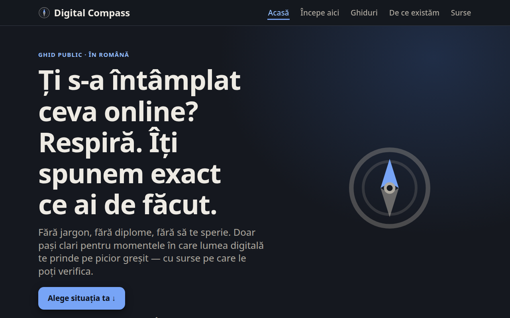

# Digital Compass

[](LICENSE)
[](LICENSE-CONTENT.md)
[](https://astro.build)

[](CONTRIBUTING.md)

> Cunoaștere publică, practică, în română, pentru momentele de criză digitală.
> **Nu diplome — claritate.**



Un ghid public care ajută omul obișnuit când i se întâmplă ceva online: un link fals, un
cont spart, o țeapă la cumpărare, un apel de înșelăciune. Fiecare situație are un
**playbook „situație → ce faci"**: respiră, pașii de urmat acum, ce să NU faci, cum
recunoști data viitoare și unde raportezi — cu **surse citate transparent**.

Nu suntem o academie și nu dăm certificate. Acoperim golul dintre discursul despre
„competențe digitale" și un drum public, clar și practic pentru om.
Vezi [pagina „De ce existăm"](src/pages/de-ce-existam.astro).

## Cum scriem — limbaj simplu, non-tehnic

Întreaga filozofie a conținutului: **scriem pe înțelesul unui om mai puțin tehnic**
(inclusiv vârstnici, non-IT). Dacă un om obișnuit se blochează la un cuvânt, l-am pierdut
— exact publicul pe care vrem să-l ajutăm.

Regulile de scriere:

- **Fără jargon gol.** Explică orice termen în cuvinte simple *înainte* de a-l numi
  (ex: „un al doilea lucru pe lângă parolă — i se spune «autentificare în doi pași»").
- **Traduce termenii tehnici pe loc** (ex: „cod QR = un pătrățel cu puncte").
- **Analogii și pași foarte concreți** („apasă pe...", „intri pe...").
- **Ton calm, reasigurant**, niciodată alarmist sau tehnic.
- **Testul „bunica":** ar înțelege un om nespecialist fiecare frază?

Aceleași reguli se aplică oricărei contribuții — vezi [CONTRIBUTING.md](CONTRIBUTING.md).

## De ce e open source

Pentru că e un proiect de bine public. Cod deschis + conținut deschis înseamnă că oricine
poate **verifica, corecta, îmbunătăți și reutiliza**. Transparența e felul nostru de a
merita încrederea — nu ți-o cerem, ți-o arătăm.

## Tehnologie

- [Astro](https://astro.build) — site static, output HTML complet, zero JS de framework.
- Conținutul e în **content collections** (`src/content/playbooks/*.md`), cu schemă
  validată în `src/content.config.ts`.
- CSS cu design tokens (`src/styles/tokens.css`), accesibil, light + dark.
- Structured data **HowTo** pe playbook-uri, sitemap, robots.

## Dezvoltare

```bash
npm install
npm run dev       # http://localhost:4321
npm run build     # generează dist/
npm run preview   # servește build-ul local
```

## Structura

```
src/
├── content/playbooks/*.md   # conținutul (situație → ce faci)
├── content.config.ts        # schema unui playbook
├── pages/                    # Home, De ce existăm, Surse, playbook/[slug], 404
├── components/               # PlaybookCard, StepList, DontList, ReportBox, SourceList...
├── layouts/BaseLayout.astro
└── styles/                   # tokens, typography, global
```

## Deploy

Vezi [DEPLOY.md](DEPLOY.md). Domeniu țintă: **compass.madeinro.eu**.

## Contribuții

Corecțiile de acuratețe, sursele oficiale noi și playbook-urile pentru situații reale sunt
binevenite. Fiindcă e conținut de siguranță, avem un standard clar — vezi
[CONTRIBUTING.md](CONTRIBUTING.md).

## Licență

- **Cod:** [MIT](LICENSE)
- **Conținut** (playbook-uri, texte): [CC BY 4.0](LICENSE-CONTENT.md)

Informația din playbook-uri e orientativă și te ajută să acționezi rapid; nu înlocuiește
instrucțiunile oficiale ale băncii, poliției sau autorităților.
